## 🔥 Firewalls

As networks began to grow, interconnect with one another, and eventually connect to the internet, it became important to control the flow of network traffic. **Firewalls** became a means of control that had to evolve and change alongside networks. They are classified into generations defined as:

- 🧱 **First-generation** – Packet Filter Firewall (Stateless)
- 🔍 **Second-generation** – Stateful Firewall
- 🧠 **Third-generation** – Application Layer Firewall
- 🚀 **Next-generation Firewall (NGFW)**

---

### 🧱 First-generation: Packet Filter Firewall (Stateless)

The first generation of firewall, also known as a **stateless firewall**, examines routing and transport layer protocol information such as source and destination network addresses, protocols, and port numbers.  
Firewall policies use these attributes to define which packets are allowed through. The rules are ordered in a list and matched from top to bottom. The last policy can be either **implicit** (deny by default) or **explicit** (configured to allow or deny).

A stateless firewall allows packets to pass if their attributes match a rule; otherwise, they are dropped or blocked.  
However, this type has significant limitations:
- ⚙️ Requires extra configuration to manage return traffic.  
- ❌ Fails to handle protocols using multiple connections (e.g., FTP).  
- 🧩 Uses a “one-size-fits-all” approach, making it easier for bad actors to bypass rules or exploit network software bugs.

---

### 🔍 Second-generation: Stateful Firewall

A **stateful firewall** improves upon the stateless version by monitoring the state of active network connections using a *5-tuple check* and maintaining them in a session table.  
It observes new and existing connections, blocking those that behave improperly or don’t match return traffic. Any packet not belonging to a known session is dropped.

While stateful firewalls enhance protection, they still cannot differentiate between legitimate and malicious traffic using acceptable protocols such as HTTP.

---

### 🧠 Third-generation: Application Layer Firewall

As HTTP became widely used for various purposes—static content, e-commerce, file sharing, and social media—network administrators needed finer control.  
**Application layer firewalls** introduced **deep packet inspection (DPI)**, allowing firewalls to analyze data payloads and understand protocols like HTTP, FTP, and DNS.

They can distinguish between:
- 🌐 Browser traffic  
- 📝 Blogs  
- 📦 File-sharing sites  
- 💬 Social media  
- ✉️ Email and ☎️ VoIP services  

These are often called **UTM (Unified Threat Management)** firewalls, as they combine multiple protections like antivirus, antispam, intrusion prevention systems (IPS), and VPNs.

---

### 🚀 Next-generation Firewall (NGFW)

The **Next-generation Firewall (NGFW)**, such as *FortiGate*, provides advanced security to meet the evolving complexity of modern networks.  
It integrates deep inspection, application awareness, identity management, and AI-driven policy enforcement.

Think of an NGFW like **airport security**:
- 🪪 Checking your **boarding pass** → verifying packets with firewall rules.  
- 🧳 Scanning your **luggage** → **Deep Packet Inspection (DPI)**.  
- 🕵️‍♂️ Setting aside suspicious bags → sandboxing for malware analysis.  

As threats evolve, NGFWs adapt with:
- 🧭 **Application-level control** – classifying traffic by app or user.  
- 🧩 **Segmentation** – isolating users, devices, and apps to reduce attack spread.  
- 🤖 **AI and automation** – enforcing security policies proactively.  
- ⚡ **High-performance inspection** – handling encrypted data and hybrid environments with minimal degradation.

Modern NGFWs are designed for **hybrid and multi-cloud data centers**, delivering:
- 🌩️ Greater agility and flexibility  
- 👀 Expanded visibility  
- 🛡️ Proactive defense across distributed environments  

---

### 🧾 Summary Diagram

```mermaid
flowchart TD
  A["[1️⃣] Stateless Firewall
(Packet Filter)"] --> B["[2️⃣] Stateful Firewall
(Session Tracking)"]
  B --> C["[3️⃣] Application Layer Firewall
(Deep Packet Inspection)"]
  C --> D["[4️⃣] Next-Generation Firewall
(AI, Segmentation, Sandboxing)"]


```

---

### 🧩 Key Takeaways

- Firewalls evolved from simple packet filters ➜ to intelligent, AI-powered systems.
- Modern firewalls perform deep inspection, application awareness, and identity-based control.
- NGFWs protect today’s hybrid and cloud-driven networks with automation, segmentation, and advanced analytics.
  classDef fw fill:#f3f4f6,stroke:#bbb,stroke-width:1px;
  class A,B,C,D fw;
