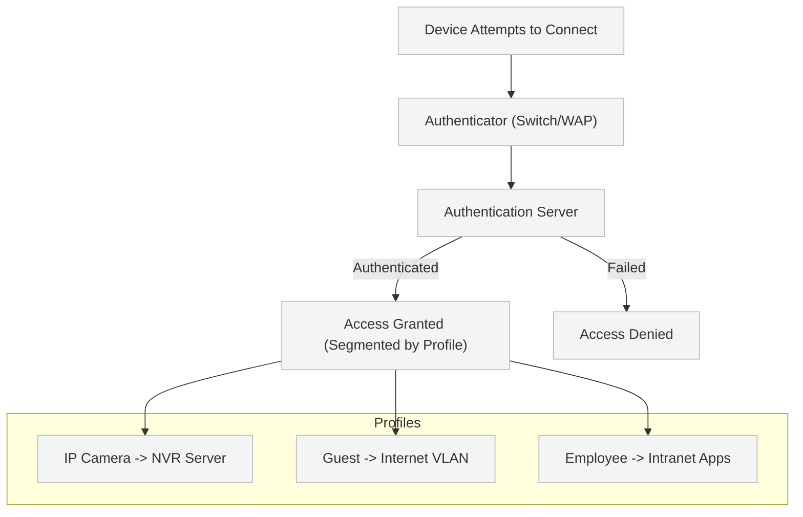

## 🌐 Network Access Control (NAC)

**Network Access Control (NAC)** is an appliance or virtual machine that manages and enforces policies for device access to a network.  
It provides **complete visibility** into all connected devices, automatically categorizes them, and evaluates **security-policy compliance** based on:

- 👤 User identity  
- 💻 Device type and operating system  
- 📍 Location  
- ⚙️ Behavior and activity patterns  

Through these checks, NAC can detect unusual or unauthorized activities and respond automatically to enforce policy.

---

### 🧩 Origins and Core Functionality

NAC began as a **network authentication and authorization mechanism** based on the **IEEE 802.1X** standard.  
This framework involves three key components:

- 💻 **Client device (Supplicant)** – The device requesting network access.  
- 🧱 **Authenticator** – The network switch or wireless access point separating the protected and unprotected networks.  
- 🔐 **Authentication server** – Validates credentials and determines access privileges.  

When a device connects, it provides credentials (username/password, digital certificate, etc.) to the authenticator, which forwards them to the authentication server.  
Depending on the result, the device is either **granted or denied** access.

---

### 🌍 Captive Portals

Another common access method—especially in public spaces—is the **captive portal**.  
☕ Example: When connecting to Wi-Fi in a coffee shop, a user may need to agree to terms on a web page before access is granted.  
This provides basic authentication and accountability for public or guest users.

---

### 📱 Challenges: BYOD and IoT

As organizations embraced **Bring Your Own Device (BYOD)** policies and the **Internet of Things (IoT)** exploded, network security became more complex.

#### ⚠️ Challenges include:
- 🔓 Personally owned devices that lack managed security (antivirus, updates, etc.)  
- 🌐 IoT devices with minimal processing power and memory  
- 🏭 Vendor-managed devices that communicate externally for updates or telemetry  

While these devices save time and money (e.g., printers automatically ordering toner), they also **expand the attack surface** and often **cannot be secured** using traditional methods.

---

### 🧠 NAC Evolution and Dynamic Profiling

Modern NAC systems overcome these weaknesses through **automated profiling** and **policy-based segmentation**:

1. 🔍 NAC identifies and classifies every device on the network.  
2. 🧭 Access is granted based on the **device’s role or function profile**.  
3. 🚫 Devices without matching profiles are **denied access**.  

💡 **Example:**  
An IP camera is allowed to connect to a network video recorder (NVR) server, but not to a finance server.  
NAC segments devices by function, limiting how far an attack can spread if a device is compromised.

---

### 🔒 Dynamic Segmentation and Security Integration

When properly deployed, NAC ensures:
- 🔐 **Micro-segmentation** – Devices are grouped by function and limited to specific network zones.  
- 🧱 **Layered defense** – Firewalls and NAC coordinate to block unauthorized communication.  
- 🛡️ **Containment** – Malware can only affect systems within the same segment.  

Contractors, partners, and guests can be granted **temporary, segmented access**, ensuring that sensitive areas remain secure.

---

### ⚙️ Automation and Policy Enforcement

NAC systems continuously adjust policies as:
- 👥 Users join or leave the organization  
- 💻 Devices are added, replaced, or retired  
- 🏢 Business requirements change  

Through **self-service portals**, NAC enables:
- 🧾 Guest and temporary access (e.g., airport or conference Wi-Fi)  
- 🔄 Automated onboarding and revocation of device access  

When integrated with the broader **security framework**, NAC can:
- 🚨 Notify the **Security Operations Center (SOC)** of breaches  
- 🤝 Coordinate with other devices via **RESTful APIs or SSH**  
- 📊 Generate reports on access attempts and compliance  

---

### 🧮 Benefits of NAC

| 💡 Feature | 🏆 Benefit |
|-------------|-------------|
| **Improved Security** | Full visibility of all devices, authenticating users and endpoints as they enter the network. |
| **Cost Savings** | Automated oversight reduces the need for manual IT intervention. |
| **Automation** | Efficient verification of users and devices at scale. |
| **Enhanced IT Experience** | Seamless, frictionless connectivity for authorized users. |
| **Ease of Control** | Centralized inventory and lifecycle management of connected endpoints. |

---

### 🧱 FortiNAC™

Fortinet’s **FortiNAC™** is a leading NAC solution that includes:
- 🌐 Full network visibility  
- 🤖 Automated policy enforcement  
- 🧩 Seamless integration with the **Fortinet Security Fabric**  
- 🚫 Automatic isolation of noncompliant or infected clients  

FortiNAC delivers enterprise-grade control and protection, adapting to the evolving security demands of hybrid and IoT-driven environments.

---

### 🗺️ Summary Diagram

---

## 🧩 Key Takeaways

- NAC provides real-time visibility and automated access control for all network-connected devices.
- It strengthens security for BYOD, IoT, and guest networks through profiling and segmentation.
- Integrated NAC systems like FortiNAC™ enhance automation, reduce manual workloads, and support dynamic security policies.
