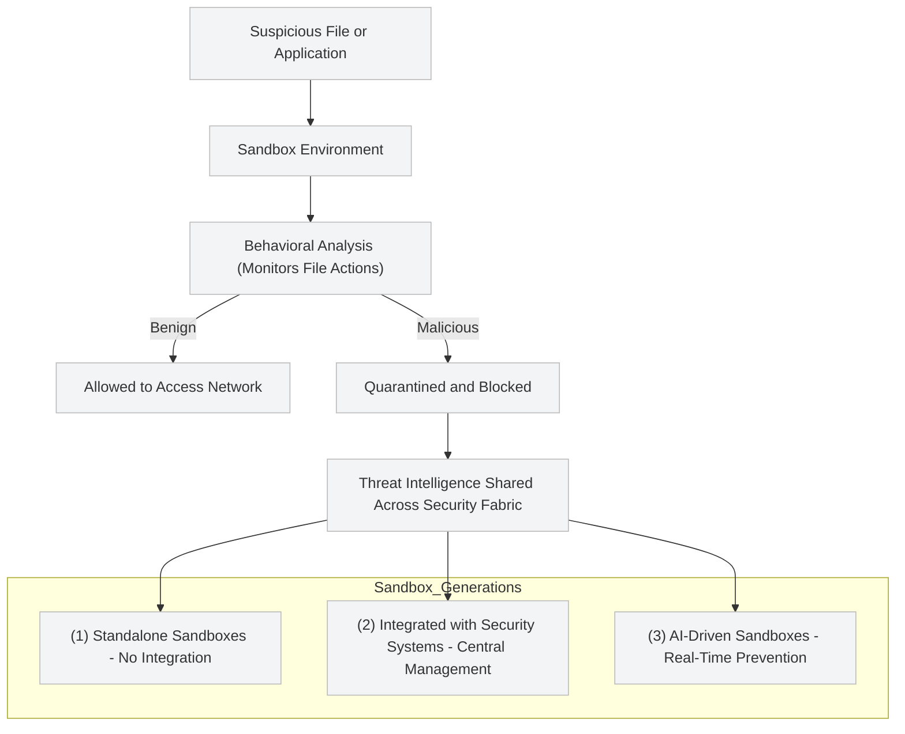

## 🧪 Sandbox

A **sandbox** is a secure, isolated virtual environment used to safely execute and analyze suspicious applications or files.  
It confines an application’s actions — such as opening a Word document or running a browser — so that any **malicious activity** is contained within the sandbox, protecting the rest of the network from harm.

If unexpected or dangerous behavior occurs, it affects **only the sandbox**, not other devices or systems.  
Sandboxes are typically managed by an organization’s **Information Security Team**, but are also used by **network, application, and desktop operations** to enhance overall cybersecurity.

---

### 🚨 Why Sandboxes Are Needed

Threat actors often exploit **vulnerabilities in legitimate applications** to compromise systems and move laterally through networks.  
While **firewalls** and **antivirus software** can stop known threats, they are ineffective against **zero-day attacks** — vulnerabilities that are unknown to developers and the security community.

🧠 **Sandboxing** was designed as a defense against these zero-day threats.

It offers:
- 🧍‍♂️ **Isolation** — Runs suspicious files in a controlled environment.  
- 🔍 **Behavior Analysis** — Observes how files or apps behave before allowing access.  
- 🚫 **Containment** — Prevents malicious files from spreading across the network.  

If a file is safe, no action is taken.  
If malicious behavior is detected, the file is **quarantined** and blocked from reaching other systems.

---

### ⚙️ Evolution of Sandboxing Solutions

Sandboxing technology has evolved through **three generations**, from standalone solutions to AI-driven integrated defenses.

---

#### 🧩 First-Generation Sandboxes

- Operated as **standalone solutions**, isolated from other security systems.  
- Could **not easily share threat intelligence** with firewalls, antivirus tools, or other network devices.  
- Required separate management consoles for each vendor product, resulting in **manual, slow, and fragmented threat analysis**.  

🧱 **Limitation:** Security teams struggled to consolidate data across multiple tools, delaying detection and response.

---

#### 🌐 Second-Generation Sandboxes

- Introduced **integration with other security systems**, improving **intelligence sharing**.  
- Enabled **centralized visibility** — analysts could monitor and respond to threats from a **single pane of glass**.  
- Leveraged **cloud-based threat intelligence services**, allowing shared data to be **distributed to multiple networks**.  

🧠 **Result:** Faster detection, coordinated response, and improved efficiency across the security architecture.

---

#### 🤖 Third-Generation Sandboxes

- Designed to counter **AI-driven cyberattacks** and **automated exploit development**.  
- Utilize the **MITRE ATT&CK** framework for consistent classification and analysis of threats.  
- Provide **real-time prevention**, not just detection — identifying breaches before they occur.  
- Incorporate **machine learning (ML)** and **artificial intelligence (AI)** to enhance accuracy and adaptability.  

💡 These modern sandboxes integrate seamlessly into **Security Fabrics**, enabling automated response and shared intelligence across firewalls, endpoints, and SIEM systems.

---

### 🧰 FortiSandbox™

**FortiSandbox™** by Fortinet represents a **third-generation sandboxing solution** and includes all advanced capabilities:  

- ⚡ **High-performance threat analysis** using AI and ML  
- 🧩 **Integration with the Fortinet Security Fabric** for unified defense  
- 🔎 **Inspection of files, websites, URLs, and network traffic** for zero-day activity  
- 🔐 **Real-time isolation and remediation** of malicious files  

🛡️ FortiSandbox allows organizations to **detect, isolate, and prevent** advanced and unknown threats before they cause damage.

---

### 🗺️ Sandboxing Workflow Diagram

### 🧩 Key Takeaways

- 🧠 Sandboxing provides a secure environment to analyze suspicious files and stop zero-day threats.
- 🔄 Integration and intelligence sharing have transformed sandboxes into proactive defenses.
- 🤖 AI-driven solutions like FortiSandbox™ detect and prevent threats in real time, enhancing the overall resilience of the security fabric.
