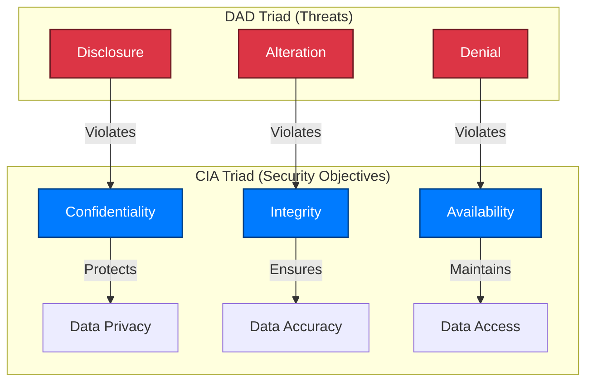

## 🔐 Principles of Information Security

The **principles of Information Security** are commonly represented by the **C-I-A Triad** —  
**Confidentiality**, **Integrity**, and **Availability**.  
These three pillars define the fundamental objectives of any security program.

---

### 🧩 The CIA Triad

1. **Confidentiality**  
   Private information must remain confidential.  
   - Only authorized users should have access to sensitive data.  
   - Systems must verify **who** is trying to access the information and whether they are **authorized**.  

2. **Integrity**  
   The assurance that information is **authentic**, **accurate**, and **unchanged**.  
   - Data must be protected from **unauthorized modification**.  
   - If data is altered, systems must **detect and alert** administrators of the change.  

3. **Availability**  
   Authorized users must have **reliable access** to information when needed.  
   - Technologies, policies, and procedures must ensure **consistent uptime** and **data access**.  
   - Redundancy, fault tolerance, and disaster recovery strategies help maintain availability.

> 🔒 Together, **Confidentiality**, **Integrity**, and **Availability** form the **CIA Triad** — the foundation of information security.

---

### ⚠️ The Opposite: The DAD Triad

Conversely, **InfoSec** also works to prevent the opposite conditions — known as the **D-A-D Triad**:  
**Disclosure**, **Alteration**, and **Denial**.

| DAD Principle | Description | Impact |
|----------------|--------------|---------|
| **Disclosure** | Exposing confidential data to unauthorized parties | Violates **Confidentiality** |
| **Alteration** | Unauthorized modification or corruption of data | Violates **Integrity** |
| **Denial** | Preventing legitimate access to information | Violates **Availability** |

An effective security solution — such as a **network firewall**, **access control policy**, or **intrusion detection system** — helps **neutralize the DAD triad** and preserve the **CIA triad**.

---

### 🧠 Summary Diagram (Mermaid)



📘 The CIA Triad represents the goals of security; the DAD Triad represents the threats that work against those goals. Effective information security strives to uphold CIA while preventing DAD.

---

## 🔐 The AAA Security Framework

The three fundamental security terms that every cybersecurity professional should understand are **Authentication**, **Authorization**, and **Accounting** — collectively known as **AAA**.  

Together, **AAA** constitutes a **security framework** that:
- Controls access to resources  
- Enforces security policies  
- Audits and monitors usage  

This framework plays a vital role in **network management** and **cybersecurity** by verifying users, controlling their permissions, and tracking their activities while connected.

---

### 🧾 1. Authentication

**Authentication** is the process of **identifying and verifying** a person or entity.  

As part of **Identity and Access Management (IAM)**, an **AAA server** compares a user’s credentials (such as username, password, or multi-factor authentication token) with its database of stored credentials to confirm their identity.

> ✅ *Authentication answers the question: “Who are you?”*

**Common Authentication Methods:**
- Passwords and PINs  
- Biometrics (fingerprint, facial recognition)  
- Smart cards and security tokens  
- Multi-Factor Authentication (MFA)

---

### 🧩 2. Authorization

**Authorization** determines what an authenticated user is **allowed to do**.  

After a user’s identity is confirmed, the system grants specific **privileges and permissions** based on their role or access level.  
These permissions are stored in a database linked to the user’s identity and can be **modified by an administrator**.

> 🔑 *Authorization answers the question: “What are you allowed to do?”*

**Examples:**
- Accessing specific directories or systems  
- Reading, writing, or deleting files  
- Using certain applications or network segments

---

### 📊 3. Accounting

**Accounting** (also known as **auditing**) is the process of **tracking and recording user activity** across computer systems and networks.  

It logs details such as:
- **Login duration** (how long a user was connected)  
- **Data usage** (amount sent or received)  
- **IP address** and **device information**  
- **URIs** (web resources accessed)  
- **Services** or applications used  

These records can be used for:
- **Auditing** user activity  
- **Analyzing** behavior trends  
- **Troubleshooting** network issues  
- **Billing** based on resource usage  

> 📘 *Accounting answers the question: “What did you do?”*

---

### 🧠 Summary of AAA

| Component | Function | Question Answered | Example |
|------------|-----------|-------------------|----------|
| **Authentication** | Identifies and verifies users | Who are you? | Username & password, MFA |
| **Authorization** | Grants access and permissions | What are you allowed to do? | File or system access control |
| **Accounting** | Tracks and records user activity | What did you do? | Audit logs, usage reports |

---

### 🧭 AAA Framework Diagram (Mermaid)

```mermaid
graph TD
    A[User] --> B[Authentication]
    B --> C[Authorization]
    C --> D[Accounting]
    D --> E[Audit Reports & Policy Enforcement]

    classDef node fill:#007BFF,stroke:#004085,color:#fff,stroke-width:1.5px,rx:6,ry:6;
    classDef end fill:#28A745,stroke:#155724,color:#fff,stroke-width:1.5px,rx:6,ry:6;

    class A,B,C,D node;
    class E end;
```

📘 In summary, the AAA framework ensures that only verified users gain access to systems (Authentication), they only access what they’re permitted to (Authorization), and their actions are recorded for auditing and compliance (Accounting).
