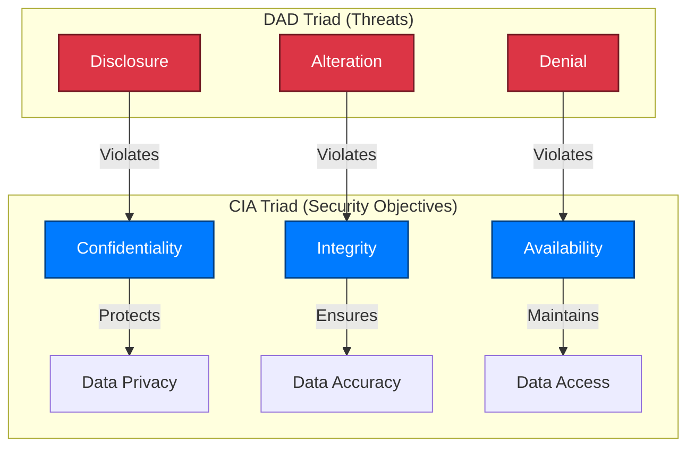

## 🔐 Principles of Information Security

The **principles of Information Security** are commonly represented by the **C-I-A Triad** —  
**Confidentiality**, **Integrity**, and **Availability**.  
These three pillars define the fundamental objectives of any security program.

---

### 🧩 The CIA Triad

1. **Confidentiality**  
   Private information must remain confidential.  
   - Only authorized users should have access to sensitive data.  
   - Systems must verify **who** is trying to access the information and whether they are **authorized**.  

2. **Integrity**  
   The assurance that information is **authentic**, **accurate**, and **unchanged**.  
   - Data must be protected from **unauthorized modification**.  
   - If data is altered, systems must **detect and alert** administrators of the change.  

3. **Availability**  
   Authorized users must have **reliable access** to information when needed.  
   - Technologies, policies, and procedures must ensure **consistent uptime** and **data access**.  
   - Redundancy, fault tolerance, and disaster recovery strategies help maintain availability.

> 🔒 Together, **Confidentiality**, **Integrity**, and **Availability** form the **CIA Triad** — the foundation of information security.

---

### ⚠️ The Opposite: The DAD Triad

Conversely, **InfoSec** also works to prevent the opposite conditions — known as the **D-A-D Triad**:  
**Disclosure**, **Alteration**, and **Denial**.

| DAD Principle | Description | Impact |
|----------------|--------------|---------|
| **Disclosure** | Exposing confidential data to unauthorized parties | Violates **Confidentiality** |
| **Alteration** | Unauthorized modification or corruption of data | Violates **Integrity** |
| **Denial** | Preventing legitimate access to information | Violates **Availability** |

An effective security solution — such as a **network firewall**, **access control policy**, or **intrusion detection system** — helps **neutralize the DAD triad** and preserve the **CIA triad**.

---

### 🧠 Summary Diagram (Mermaid)

📘 The CIA Triad represents the goals of security; the DAD Triad represents the threats that work against those goals. Effective information security strives to uphold CIA while preventing DAD.
