## 🔎 Threat Landscape — Who Is a Bad Actor?

**Bad actors** (also called **threat actors**) are persons or groups who attempt to **steal, sabotage, or deny** access to computer systems or information — whether that information is at rest or in transit. Motivations vary (money, notoriety, ideology, national interest), and motivations influence the methods used. Bad actors are **not** a homogeneous group: they can be anyone, anywhere — from a curious teenager to an organized nation-state force.

---

### 👥 Common Types of Bad Actors

| Type | Motivation | Typical Methods / Notes |
|------|------------|--------------------------|
| **Explorer** | Notoriety, curiosity | Probes systems to find weaknesses; may deface sites or demonstrate exploits; often not seeking major damage. |
| **Hacktivist** | Ideology / political or social causes | Collective campaigns, DDoS (via botnets), website defacement, doxxing; seeks anonymity and public impact. |
| **Cyberterrorist** | Ideology aimed at societal harm | Targets operational technology (power grids, pipelines), spear-phishing, attempts to intimidate or destabilize society. |
| **Cybercriminal** | Financial gain | Phishing, identity/theft, credit card fraud, ransomware, selling data on black markets. |
| **Cyberwarrior** | Nation-state interests | Espionage, sabotage, targeted cyberweapons, zero-day exploits; highly resourced and sometimes secretive. |

> Bad actors may overlap or collaborate (e.g., criminals working with nation-state actors), and roles are fluid depending on goals and resources.

---

### 🛠️ Common Attack Methods

- **Phishing** — Tricking users (usually by email) into revealing credentials or sensitive data.  
  - **Spear phishing** — Targeted phishing at a specific individual or group.  
  - **Smishing / Vishing** — Phishing via SMS (smishing) or voice calls (vishing).

- **Botnets & DDoS** — Compromised devices (botnet nodes) are commanded by a C&C server to flood a target, causing downtime (Distributed Denial of Service).

- **Ransomware** — Malware that encrypts or blocks access to data/systems until a ransom is paid.

- **Social Engineering** — Manipulating people into bypassing security controls (e.g., pretexting, impersonation).

- **Zero-day Exploits** — Leveraging previously unknown vulnerabilities for which no vendor patch exists yet.

---

### 🧩 Phishing — a Short Example

A typical phishing scenario:
1. Victim receives an email that appears to be from a legitimate organization and is asked to log in immediately.  
2. The email links to a **rogue look-alike site** (not the real site).  
3. The victim enters credentials; the rogue site captures them and may return a fake "incorrect password" message to mask the theft.  
4. The attacker now has valid credentials and can log in as the victim.

The same trust + urgency formula applies to spear phishing, smishing, and vishing.

---

### ⚠️ Why Understanding Bad Actors Matters

- **Motivation drives method** — Knowing who you’re defending against helps choose defenses.  
- **Anyone can be an attacker** — Threats may be local, insider, or remote.  
- **Defenses must be layered** — Technical controls, user education, monitoring, incident response, and patch management all matter.  
- **Secrets and timing matter** — Especially for zero-day exploits: attackers must keep an exploit secret until used, because vendors patch known vulnerabilities quickly.

---

### ✅ Defensive Takeaways

- Train users to recognize phishing and social engineering.  
- Maintain good patch management to reduce zero-day exposure.  
- Use backups and incident response plans to mitigate ransomware.  
- Monitor for anomalous activity (to detect botnet participation, credential misuse, etc.).  
- Apply the principle of least privilege and strong authentication to limit attacker impact.

---

## 🎩 Categories of Hackers

Just as there are different types of **bad actors**, there are also distinct **categories of hackers**, each identified by a **symbolic color** that represents their intent and behavior. These hacker types range from ethical professionals to malicious intruders, with shades of grey in between.

---

### 🧑‍💻 Main Hacker Categories

| Hacker Type | Color | Description | Intent / Motivation |
|--------------|--------|--------------|----------------------|
| **White Hat** | 🤍 | Ethical hackers who, with proper authorization, probe networks to identify and fix vulnerabilities. Often work in cybersecurity, IT auditing, or as penetration testers. | Security improvement and defense. |
| **Black Hat** | 🖤 | Malicious hackers who exploit vulnerabilities for personal gain or to cause harm (e.g., data theft, system disruption). | Profit, sabotage, or notoriety. |
| **Grey Hat** | ⚪⚫ | Hackers who breach systems without permission but without malicious intent. They may reveal vulnerabilities publicly or to the organization after discovery. | Curiosity, recognition, or perceived “public good.” |
| **Blue Hat** | 💙 | External security experts hired by organizations (often before a product launch) to perform penetration testing and detect vulnerabilities. | Preemptive security assessment. |

---

### 🧠 Key Takeaways

- **Intent defines the color** — The same technical skill set can be used ethically or maliciously.  
- **White hats** strengthen defenses; **black hats** exploit weaknesses.  
- **Grey hats** blur ethical boundaries but often lack criminal intent.  
- **Blue hats** provide independent validation of system security prior to deployment.

---

### 🕸️ Visual Summary (Mermaid Diagram)

```mermaid
graph LR
    A[Hackers] --> B[🤍 White Hat<br/>Ethical, authorized testing]
    A --> C[🖤 Black Hat<br/>Malicious, unauthorized attacks]
    A --> D[⚪⚫ Grey Hat<br/>Unauthorized but not malicious]
    A --> E[💙 Blue Hat<br/>External testers hired pre-launch]
```

