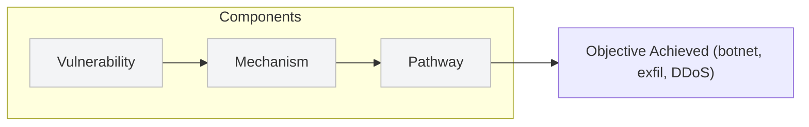
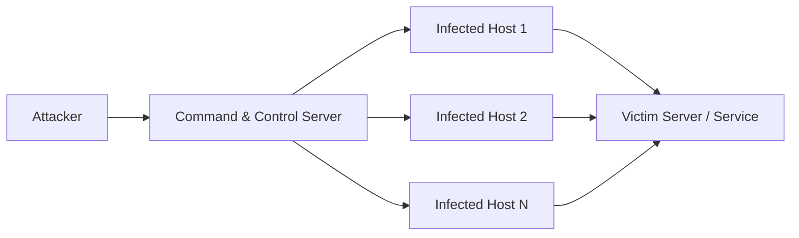

## 🧭 Malware Attack Vectors and Methods

### ❓ What is an Attack Vector?
An **attack vector** (or **threat vector**) is a **method** a bad actor uses to illegally access, disrupt, or inhibit a network, system, or facility.  
An attack vector can be a **specific technique** (e.g., a phishing email) or a **category** (e.g., social engineering).  

Remember: an attack vector has **three components**:
1. **Vulnerability** — the weakness being exploited (e.g., a user, unpatched service).  
2. **Mechanism** — the tool or payload that exploits the vulnerability (e.g., malware, exploit code).  
3. **Pathway** — the channel used to deliver the mechanism (e.g., email, USB, compromised website).

---

### 🔍 Attack Vector vs Attack Surface
- **Attack Vector** = the method used to attack.  
- **Attack Surface** = the total set of entry points that attackers can try (the “exposed” parts of your environment).

> Example: Tightening password policy reduces the attack surface; lax rules expand it.  
> Goal of security: **reduce the attack surface** and block or harden likely vectors.

---

### 🦠 Malware-Focused Attack Vectors (Examples)

#### Watering Hole
- **Pathway:** A site or forum frequently visited by a target group.  
- **Mechanism:** Inject malicious content or links (Trojan horse).  
- **Vulnerability:** Visitors trusting the site and clicking content.

#### Phishing → Botnet Recruitment
- **Pathway:** Mass phishing emails or malicious attachments.  
- **Mechanism:** Malware that installs a bot (zombie) on the host.  
- **Vulnerability:** Human click, unpatched clients, macros enabled.  
- **Result:** Many infected machines under a **C&C (Command & Control)** server become a **botnet** used for spam, DDoS, data harvesting, etc.

---

### 🧩 Common Clandestine Mechanisms & Exploitation Methods

- **Backdoor** — Hidden access channel installed for remote entry.  
- **Logic Bomb** — Malicious code that triggers when certain conditions are met.  
- **Easter Egg (malicious use)** — Hidden code/features that may expose systems if abused.  
- **Dropper** — A program whose job is to install other malicious files/payloads.  
- **Downloader** — A Trojan that waits for connectivity then downloads additional malware.  
- **Shellcode** — Small payload code run to achieve control (often used in exploits).  
- **Code Injection** — Injecting and executing malicious code inside an application (e.g., SQL injection, script injection).

---

### 🔁 Attack Vector Chain (Example Flow)

1. **Recon / Targeting** (find site/users)  
2. **Compromise Watering Hole** (pathway established)  
3. **Deliver Payload** (visitor clicks link)  
4. **Dropper/Downloader executes** (mechanism runs)  
5. **Install Backdoor / Bot / RAT** (persistence & C2)  
6. **Lateral Movement / Data Exfiltration / DDoS** (impact)

---

### 🤖 Botnet & C&C (Command & Control) — Simple Diagram

> Notes: botnets can be used for spam, credential harvesting, distributed attacks (DDoS), or as a staging platform for lateral movement.

---

### 🛡️ Defensive Considerations (short list)

- Harden attack surface: reduce exposed services, enforce strong password & MFA.
- Patch management: apply vendor fixes quickly to remove exploitable vulnerabilities.
- Email/web filtering: block known malicious domains and attachments.
- Application controls: disable unsigned applets, block macro execution by default.
- Endpoint protection & EDR: detect droppers, downloaders, and suspicious persistence.
- Network segmentation & monitoring: limit lateral movement and detect abnormal traffic to C&C.
- User training: reduce successful phishing and watering-hole interactions.
- Deception & honeypots: catch attackers early and collect IoCs.

---

### ✅ Key Takeaways

- An attack vector = vulnerability + mechanism + pathway.
- Watering holes and phishing-to-botnet flows are common malware attack paths.
- A layered defense (people, processes, tech) that reduces attack surface and detects clandestine mechanisms is essential.
